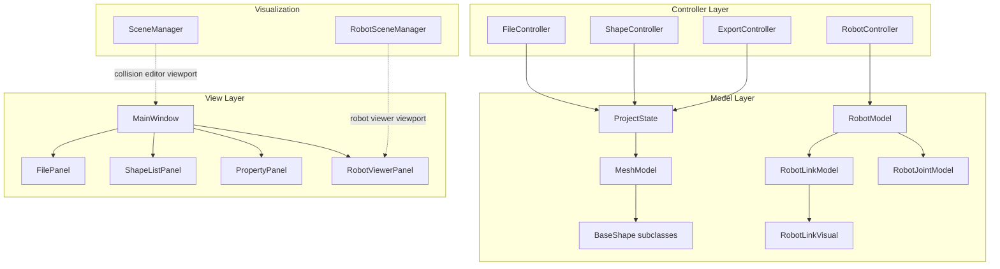
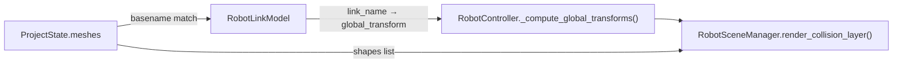
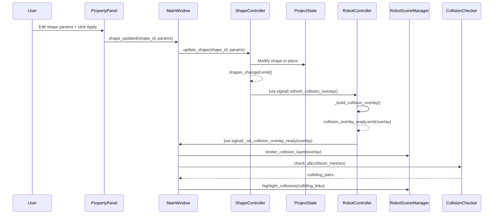

# Integrated Collision Visualization & Validation in Robot Viewer
> [!NOTE]
> **Status**: ✅ **Implemented**. This document serves as the original design and reference for the dual-layer visualization and collision detection system.


Complete implementation plan for extending the Robot Viewer to display collision shapes over visual meshes, detect inter-link collisions, and support live updates from the collision editor.

---

## Current Architecture Summary

Before diving in, here is the existing architecture that this plan builds upon:



> [!IMPORTANT]
> **Key Constraint**: The collision editor (`SceneManager`) and robot viewer (`RobotSceneManager`) operate on **separate PyVista plotters**. The robot viewer is read-only. All editing happens in the main editor viewport.

---

## 1. Data Flow Integration

### Problem
Currently, `RobotModel` (links + joints + visuals) and `ProjectState` (meshes + collision shapes) are **completely separate data silos**. There is no mechanism to map a collision shape from `ProjectState.meshes[i].shapes` to a specific `RobotLinkModel` in the `RobotModel`.

### Solution: Mesh-to-Link Mapping via Filename

The existing codebase already uses **basename matching** in two places:
- [file_controller.py:L96](file:///home/youmad55/my%20github%20repos/URDF%20collision%20editor%20tool/controllers/file_controller.py#L96) — `mesh_lookup = {os.path.basename(m.file_path): m for m in self.state.meshes}`
- [urdf_modifier.py:L30](file:///home/youmad55/my%20github%20repos/URDF%20collision%20editor%20tool/utils/urdf_modifier.py#L30) — `basename_lookup = {os.path.basename(m.file_path): m for m in meshes}`

The `RobotLinkVisual` already stores `mesh_filename` (basename). Therefore:

```
RobotLinkModel.visuals[i].mesh_filename  ←→  os.path.basename(MeshModel.file_path)
```

**Data flow for collision overlay:**



### Concrete Mapping Logic (in RobotController)

```text
for each link_name, link_model in robot_model.links:
    for each visual in link_model.visuals:
        if visual.type == "mesh" and visual.mesh_filename != "":
            matched_mesh = mesh_basename_lookup.get(visual.mesh_filename)
            if matched_mesh and matched_mesh.shapes:
                collision_data[link_name] = {
                    "shapes": matched_mesh.shapes,
                    "visual_scale": visual.scale,
                    "visual_origin": visual.origin,
                    "mesh_urdf_origin": matched_mesh.urdf_origin_xyz/rpy,
                    "mesh_urdf_scale": matched_mesh.urdf_scale
                }
```

> [!NOTE]
> No new data is duplicated. The mapping is computed on-demand when the robot viewer refreshes. `ProjectState` remains the single source of truth for collision shapes.

---

## 2. Model Changes

### Approach: No New Model Classes — Use a Computed Mapping DTO

Rather than introducing a heavyweight `RobotLinkCollision` dataclass that would duplicate data from `MeshModel`, the plan uses a lightweight **data transfer object (DTO)** that is computed by the controller and consumed by `RobotSceneManager`.

#### [NEW] `models/collision_mapping.py`

A simple dataclass to hold per-link collision rendering data:

```text
@dataclass
class LinkCollisionData:
    link_name: str
    shapes: list[BaseShape]           # Reference to MeshModel.shapes (NOT a copy)
    visual_scale: list[float]         # From RobotLinkVisual.scale  [sx, sy, sz]
    visual_origin: RobotVisualOrigin  # From RobotLinkVisual.origin
    mesh_urdf_origin_xyz: list[float] # From MeshModel.urdf_origin_xyz
    mesh_urdf_scale: list[float]      # From MeshModel.urdf_scale

@dataclass
class CollisionOverlayData:
    """Complete collision overlay payload sent to RobotSceneManager."""
    link_collisions: dict[str, LinkCollisionData]   # link_name → data
    global_transforms: dict[str, np.ndarray]         # link_name → 4×4
```

**Why this approach:**
- **No data duplication**: `shapes` is a reference list, not a deep copy
- **No model pollution**: `RobotModel` and `MeshModel` remain unchanged
- **Ephemeral**: Recomputed on every refresh; never serialized
- **Clean separation**: The DTO carries everything `RobotSceneManager` needs to render, so the visualization layer never touches `ProjectState` directly

#### What stays unchanged
| File | Change |
|------|--------|
| [project_state.py](file:///home/youmad55/my%20github%20repos/URDF%20collision%20editor%20tool/models/project_state.py) | ❌ No change |
| [mesh_model.py](file:///home/youmad55/my%20github%20repos/URDF%20collision%20editor%20tool/models/mesh_model.py) | ❌ No change |
| [robot_model.py](file:///home/youmad55/my%20github%20repos/URDF%20collision%20editor%20tool/models/robot_model.py) | ❌ No change |
| [base_shape.py](file:///home/youmad55/my%20github%20repos/URDF%20collision%20editor%20tool/models/shapes/base_shape.py) | ❌ No change |
| All shape subclasses | ❌ No change |

---

## 3. Controller Changes

### 3.1 RobotController — Collision Data Provider

#### [MODIFY] [robot_controller.py](file:///home/youmad55/my%20github%20repos/URDF%20collision%20editor%20tool/controllers/robot_controller.py)

**New responsibilities:**
1. Accept a `ProjectState` reference (passed during construction)
2. Build the mesh-to-link mapping on refresh
3. Emit a new signal carrying `CollisionOverlayData`
4. Expose a `refresh_collision_overlay()` method callable externally

**New signal:**
```text
collision_overlay_ready = pyqtSignal(object)  # CollisionOverlayData
```

**Modified `__init__`:**
```text
def __init__(self, project_state: ProjectState, parent=None):
    self._project_state = project_state   # NEW: reference to shared state
    ...
```

**New method `_build_collision_overlay()`:**
```text
def _build_collision_overlay(self) -> CollisionOverlayData | None:
    if not self._current_model or not self._project_state.meshes:
        return None
    
    # Build basename → MeshModel lookup
    mesh_lookup = {os.path.basename(m.file_path): m for m in self._project_state.meshes}
    
    # Build link → collision data mapping
    link_collisions = {}
    for link_name, link_model in self._current_model.links.items():
        for visual in link_model.visuals:
            if visual.type == "mesh" and visual.mesh_filename:
                matched = mesh_lookup.get(visual.mesh_filename)
                if matched and matched.shapes:
                    link_collisions[link_name] = LinkCollisionData(
                        link_name=link_name,
                        shapes=matched.shapes,
                        visual_scale=visual.scale,
                        visual_origin=visual.origin,
                        mesh_urdf_origin_xyz=matched.urdf_origin_xyz,
                        mesh_urdf_scale=matched.urdf_scale,
                    )
    
    transforms = self._compute_global_transforms(self._current_model, self._selected_frame)
    return CollisionOverlayData(link_collisions=link_collisions, global_transforms=transforms)
```

**Modified `_refresh_visualization()`:**
```text
def _refresh_visualization(self):
    if not self._current_model:
        return
    transforms = self._compute_global_transforms(...)
    self.robot_loaded.emit(self._current_model, transforms)
    
    # NEW: Also emit collision overlay
    overlay = self._build_collision_overlay()
    if overlay:
        self.collision_overlay_ready.emit(overlay)
```

**New public method for live updates:**
```text
def refresh_collision_overlay(self):
    """Called externally when collision shapes change in ProjectState."""
    overlay = self._build_collision_overlay()
    if overlay:
        self.collision_overlay_ready.emit(overlay)
```

### 3.2 ShapeController — Emit Change Notification

#### [MODIFY] [shape_controller.py](file:///home/youmad55/my%20github%20repos/URDF%20collision%20editor%20tool/controllers/shape_controller.py)

**Problem**: `ShapeController` is a plain class (not a QObject), so it cannot emit signals.

**Solution**: Convert to QObject and add a signal.

```text
class ShapeController(QObject):
    shapes_changed = pyqtSignal()     # NEW signal
    
    def __init__(self, state, parent=None):
        super().__init__(parent)
        self.state = state
```

**Emit `shapes_changed`** after all mutating operations:
- `add_shape()` → emit after `mesh.add_shape(shape)`
- `remove_shape()` → emit after `mesh.remove_shape(shape_id)`
- `update_shape()` → emit after parameter update loop
- `undo()` / `redo()` → emit after successful state restore

### 3.3 MainWindow Wiring

#### [MODIFY] [main_window.py](file:///home/youmad55/my%20github%20repos/URDF%20collision%20editor%20tool/views/main_window.py)

**In `__init__`:**
```text
# Pass ProjectState to RobotController
self._robot_ctrl = RobotController(self._state, parent=self)

# ShapeController now needs parent for QObject
self._shape_ctrl = ShapeController(self._state, parent=self)
```

**In `_wire_signals()`:**
```text
# NEW: ShapeController → RobotController (live updates)
self._shape_ctrl.shapes_changed.connect(self._robot_ctrl.refresh_collision_overlay)

# NEW: RobotController → RobotSceneManager (collision overlay)
self._robot_ctrl.collision_overlay_ready.connect(self._on_collision_overlay_ready)

# NEW: RobotViewerPanel toggles
self._robot_panel.visual_toggled.connect(self._on_visual_toggle)
self._robot_panel.collision_toggled.connect(self._on_collision_toggle)
```

---

## 4. Visualization System

### RobotSceneManager — Dual-Layer Rendering

#### [MODIFY] [robot_scene_manager.py](file:///home/youmad55/my%20github%20repos/URDF%20collision%20editor%20tool/visualization/robot_scene_manager.py)

The current `RobotSceneManager` only manages one flat dict of actors (`self._actors`). It needs to support **two independent layers** with separate visibility controls.

**New internal state:**
```text
self._visual_actors: Dict[str, pv.Actor] = {}       # link__i → actor
self._collision_actors: Dict[str, pv.Actor] = {}    # coll__link__shape_id → actor
self._colliding_links: set[str] = set()              # links currently in collision

self._visual_visible: bool = True
self._collision_visible: bool = True
```

### 4.1 Visual Layer (Refactor of Existing)

The existing `render_robot()` method becomes `render_visual_layer()`. It stores actors in `self._visual_actors` instead of `self._actors`, and rendering can be skipped if `self._visual_visible` is False.

### 4.2 Collision Layer (New)

**New method `render_collision_layer(overlay: CollisionOverlayData)`:**

For each link in `overlay.link_collisions`:
1. Get the link's global transform from `overlay.global_transforms`
2. For each shape in `link_collisions[link_name].shapes`:
   a. Generate the PyVista mesh via `shape.to_pyvista_mesh()` (reuse existing method)
   b. Compute the **URDF-space transform** (see Section 8)
   c. Apply the global link transform on top
   d. Add to plotter with **green color, semi-transparent** (see Section 9)
   e. Store actor in `self._collision_actors`

**Key**: Only clear and re-render collision actors, never touch visual actors (and vice versa).

### 4.3 Visibility Control

```text
def set_visual_visible(self, visible: bool):
    self._visual_visible = visible
    for actor in self._visual_actors.values():
        actor.SetVisibility(visible)
    self.plotter.render()

def set_collision_visible(self, visible: bool):
    self._collision_visible = visible
    for actor in self._collision_actors.values():
        actor.SetVisibility(visible)
    self.plotter.render()
```

> [!TIP]
> Using VTK's `actor.SetVisibility()` is a zero-cost operation compared to removing/re-adding actors. It avoids re-loading meshes entirely.

---

## 5. Collision Detection System

### Algorithm Selection

| Pair Type | Algorithm | Rationale |
|-----------|-----------|-----------|
| Primitive ↔ Primitive | **AABB pre-filter → Analytic test** | Box-Box, Sphere-Sphere, Cylinder comparisons have closed-form solutions. AABB first to cull non-overlapping pairs quickly. |
| Primitive ↔ STL | **AABB pre-filter → Mesh-primitive intersection via VTK** | PyVista wraps VTK's `vtkOBBTree` which supports ray/mesh intersection. Convert primitive to mesh, then use `vtkBooleanOperationPolyDataFilter` or bounding overlap. |
| STL ↔ STL | **AABB pre-filter → OBB tree overlap** | Use VTK's `vtkOBBTree` on both meshes. For large meshes, approximate with simplified convex hulls via `mesh.extract_surface().decimate(0.9)`. |

### Proposed Module

#### [NEW] `utils/collision_checker.py`

```text
class CollisionChecker:
    """Detects intersections between rendered collision shapes in robot space."""
    
    def check_all(self, collision_meshes: dict[str, list[pv.PolyData]]) -> list[tuple[str, str]]:
        """
        Input:  {link_name: [pv.PolyData already in global frame]}
        Output: [(link_a, link_b), ...] — pairs of colliding links
        """
```

**Algorithm outline:**
1. For each link, compute AABB of its collision meshes (union of all shape AABBs)
2. Broad phase: pairwise AABB overlap test between all links → candidate pairs
3. Narrow phase: for each candidate pair, test mesh-level intersection:
   - Compute `boolean_intersection = meshA.boolean_intersection(meshB)`
   - If result has > 0 cells → collision detected
4. Return list of colliding link pairs

### Performance Considerations

- **Update frequency**: Run **only when collision shapes change** (on `shapes_changed` signal), NOT on every frame or camera move
- **Skip self-collision**: A link's own shapes are expected to overlap; only check inter-link pairs
- **Skip non-adjacent links**: Optionally limit to links connected by ≤ 2 joints (configurable)
- **Debounce**: If rapid edits occur, debounce collision checks with a 200ms `QTimer.singleShot()`
- **Approximation for STL**: If STL mesh has > 10,000 faces, auto-decimate to ~2,000 faces for collision testing only (not display)

### Collision Result Handling

```text
colliding_pairs: list[tuple[str, str]]  →  RobotSceneManager.highlight_collisions(colliding_links: set[str])
```

The scene manager receives the set of link names involved in at least one collision and adjusts their collision shape actors to **red** (see Section 9).

---

## 6. Visibility Toggles (UI)

### RobotViewerPanel Changes

#### [MODIFY] [robot_viewer_panel.py](file:///home/youmad55/my%20github%20repos/URDF%20collision%20editor%20tool/views/robot_viewer_panel.py)

**Add two QCheckBox widgets** in the panel between the frame selector and the 3D viewport:

```text
Toggle row layout:
┌──────────────────────────────────────────────┐
│ ☑ Visual Meshes        ☑ Collision Shapes    │
└──────────────────────────────────────────────┘
```

**New signals:**
```text
visual_toggled = pyqtSignal(bool)
collision_toggled = pyqtSignal(bool)
```

**Checkbox setup:**
```text
toggle_row = QHBoxLayout()

self._visual_cb = QCheckBox("Visual Meshes")
self._visual_cb.setChecked(True)
self._visual_cb.toggled.connect(self.visual_toggled.emit)

self._collision_cb = QCheckBox("Collision Shapes")
self._collision_cb.setChecked(True)
self._collision_cb.toggled.connect(self.collision_toggled.emit)

toggle_row.addWidget(self._visual_cb)
toggle_row.addWidget(self._collision_cb)
layout.addLayout(toggle_row)
```

**Connection flow:**
```mermaid
flowchart LR
    A["☑ Visual Meshes"] -->|visual_toggled(bool)| B[MainWindow]
    B -->|set_visual_visible(bool)| C[RobotSceneManager]
    
    D["☑ Collision Shapes"] -->|collision_toggled(bool)| B
    B -->|set_collision_visible(bool)| C
```

**Behavior matrix:**

| Visual | Collision | Scene shows |
|--------|-----------|-------------|
| ✅ | ✅ | Robot meshes + green collision shapes |
| ✅ | ❌ | Robot meshes only |
| ❌ | ✅ | Collision shapes only (useful for inspection) |
| ❌ | ❌ | Empty scene (axes only) |

---

## 7. Live Update Mechanism

### Signal/Slot Flow (End-to-End)



### Which Component Triggers What

| Trigger | Source | Receiver | Action |
|---------|--------|----------|--------|
| Shape added/removed/edited | `ShapeController.shapes_changed` | `RobotController.refresh_collision_overlay()` | Rebuild + re-emit overlay |
| Undo/Redo | `ShapeController.shapes_changed` | Same as above | Same as above |
| URDF loaded | `RobotController.robot_loaded` | `MainWindow._on_robot_loaded` | Render full robot + first overlay |
| Frame changed | `RobotViewerPanel.frame_changed` | `RobotController.set_base_frame()` | Re-renders both layers |
| Toggle visibility | `RobotViewerPanel.visual_toggled` / `collision_toggled` | `RobotSceneManager.set_*_visible()` | VTK actor visibility toggle |

---

## 8. Transform & Scale Handling

### The Transform Chain

Each collision shape must be displayed at **exactly the position it will occupy in the exported URDF**. The transform chain is:

```text
final_world_position = global_link_transform                   # From kinematic chain (joints)
                     @ visual_origin_transform                  # From <visual><origin> in URDF
                     @ collision_shape_local_transform          # Shape's own position/rotation
```

But there's a complication: the collision editor operates in **Normalized Display Space** (scale=1.0), while the URDF export applies scale multiplication. The robot viewer must **match the export result**.

### Scale Correction for Robot Viewer

The export logic in [urdf_modifier.py:L80-L86](file:///home/youmad55/my%20github%20repos/URDF%20collision%20editor%20tool/utils/urdf_modifier.py#L80-L86) does:

```python
# Export position = (shape.position * visual_scale) + visual_origin_xyz
s.position[0] = (s.position[0] * sx) + vx
```

Therefore, in the robot viewer we must replicate this:

```text
def _compute_collision_transform(shape, link_data, global_link_transform):
    sx, sy, sz = link_data.visual_scale      # from the URDF <mesh scale="...">
    vx, vy, vz = link_data.mesh_urdf_origin_xyz

    # 1. Scale the shape's position into URDF space
    urdf_pos = [
        shape.position[0] * sx + vx,
        shape.position[1] * sy + vy,
        shape.position[2] * sz + vz,
    ]

    # 2. Build rotation matrix from shape orientation (degrees → radians)
    R = build_rotation_matrix(shape.orientation_rad)

    # 3. Build 4×4 local transform
    local_T = np.eye(4)
    local_T[:3, :3] = R
    local_T[:3, 3] = urdf_pos

    # 4. Apply global link transform
    final_T = global_link_transform @ local_T
    return final_T
```

### Geometry Scaling

For **primitive shapes** (Box, Cylinder, Sphere), the geometry dimensions must also be scaled, mirroring [urdf_modifier.py:L89-L99](file:///home/youmad55/my%20github%20repos/URDF%20collision%20editor%20tool/utils/urdf_modifier.py#L89-L99):

| Shape | Scale Rule |
|-------|-----------|
| Box | `size *= [sx, sy, sz]` |
| Cylinder | `radius *= max(sx, sy)`, `length *= sz` |
| Sphere | `radius *= max(sx, sy, sz)` |
| STL | `mesh.scale(user_scale * urdf_visual_scale)` — already handled by `StlShape.to_urdf_geometry()` logic |

> [!IMPORTANT]
> The existing `shape.to_pyvista_mesh()` generates meshes in **normalized display space**. For the robot viewer, we must create a **separate rendering path** that applies URDF-scale corrections. This is done in `RobotSceneManager`, NOT by modifying the shape's `to_pyvista_mesh()` (which would break the collision editor).

**Implementation approach**: A new helper method in `RobotSceneManager`:

```text
def _create_collision_mesh(self, shape: BaseShape, visual_scale: list[float]) -> pv.PolyData:
    """Creates a PyVista mesh for a collision shape in URDF-scaled space."""
    import copy
    s = copy.deepcopy(shape)  # Deep copy to avoid mutating ProjectState
    
    # Apply scale corrections identical to urdf_modifier
    if isinstance(s, BoxShape):
        s.size_x *= visual_scale[0]
        s.size_y *= visual_scale[1]
        s.size_z *= visual_scale[2]
    elif isinstance(s, CylinderShape):
        s.radius *= max(visual_scale[0], visual_scale[1])
        s.length *= visual_scale[2]
    elif isinstance(s, SphereShape):
        s.radius *= max(visual_scale)
    # STL: generate mesh at user_scale (shape.scale already applied in to_pyvista_mesh)
    
    # Generate raw mesh without position transform
    # (position will be applied via the final_T matrix)
    mesh = s._create_raw_mesh()  # New method needed: see below
    return mesh
```

> [!NOTE]
> This requires adding a `_create_raw_mesh()` method to `BaseShape` subclasses that returns the mesh at origin without position/rotation transform. This is a minor addition that doesn't affect existing behavior — `to_pyvista_mesh()` continues to call `_create_raw_mesh()` + `_apply_transform()`.

---

## 9. Color & Rendering Rules

### Color Assignments

| Element | Color | Opacity | When |
|---------|-------|---------|------|
| Visual mesh | `#a0b0c0` (existing) | 0.8 | Always (when visual layer ON) |
| Collision shape (normal) | `#00cc55` (green) | 0.35 | No collision detected |
| Collision shape (colliding) | `#ff2222` (red) | 0.55 | Link participates in collision |

### Dynamic Color Switching

**In `RobotSceneManager`:**

```text
def highlight_collisions(self, colliding_links: set[str]):
    """Recolor collision actors based on collision status."""
    prev = self._colliding_links
    self._colliding_links = colliding_links
    
    # Only update changed actors to avoid flickering
    changed_links = prev.symmetric_difference(colliding_links)
    
    for actor_key, actor in self._collision_actors.items():
        link_name = self._extract_link_from_actor_key(actor_key)
        if link_name not in changed_links:
            continue
        
        prop = actor.GetProperty()
        is_colliding = link_name in colliding_links
        color = "#ff2222" if is_colliding else "#00cc55"
        opacity = 0.55 if is_colliding else 0.35
        
        prop.SetColor(pv.Color(color).float_rgb)
        prop.SetOpacity(opacity)
    
    self.plotter.render()
```

### Anti-Flickering Strategy

1. **Never remove + re-add** actors for color changes; use VTK property modification in-place
2. **Batch render**: Use `render=False` for all intermediate operations, single `plotter.render()` at end
3. **Diff-based updates**: Only modify actors for links whose collision status actually changed (the `symmetric_difference` check above)

---

## 10. Performance Strategy

### 10.1 Mesh Caching

**Problem**: Each `render_collision_layer()` call shouldn't reload STL files from disk.

**Solution**: Cache PyVista meshes by shape ID + relevant parameters.

```text
self._mesh_cache: Dict[str, pv.PolyData] = {}   # cache_key → mesh

def _get_cache_key(self, shape: BaseShape) -> str:
    # Include all params that affect geometry
    if isinstance(shape, BoxShape):
        return f"{shape.id}_{shape.size_x}_{shape.size_y}_{shape.size_z}"
    elif isinstance(shape, StlShape):
        return f"{shape.id}_{shape.stl_path}_{tuple(shape.scale)}"
    ...
```

### 10.2 Incremental Updates

**Problem**: Updating all collision shapes when only one changed is wasteful.

**Solution**: Track which shape IDs are currently rendered. On update:
1. Compare new shape list vs. rendered shape list
2. Remove only actors for shapes that were removed or changed
3. Add only actors for new or changed shapes
4. Skip unchanged shapes entirely

**Detection of "changed"**: Compare shape parameters hash (position, orientation, dimensions) against cached values.

### 10.3 Actor Management

The existing actor management pattern (storing actor references, removing by name) works well. For the collision layer:

```text
Actor key format: f"coll__{link_name}__{shape.id}"
```

This ensures unique keys and easy extraction of the link name for collision highlighting.

### 10.4 Collision Detection Debouncing

```text
# In MainWindow
self._collision_check_timer = QTimer()
self._collision_check_timer.setSingleShot(True)
self._collision_check_timer.setInterval(200)  # ms
self._collision_check_timer.timeout.connect(self._run_collision_check)

def _on_collision_overlay_ready(self, overlay):
    self._current_overlay = overlay
    self._robot_scene.render_collision_layer(overlay)
    self._collision_check_timer.start()  # Debounced
```

---

## 11. Edge Cases

| Edge Case | Handling |
|-----------|----------|
| **Link with no collision shapes** | Skip in mapping; no collision actor created. Visual mesh renders normally. |
| **Shape not mapped to any link** | This happens for meshes loaded manually (not from URDF). These shapes only appear in the collision editor, never in the robot viewer. Log a debug message if needed. |
| **Invalid transforms** (NaN, degenerate matrix) | Validate `np.linalg.det(T) != 0` before applying. Skip shape with a warning if invalid. |
| **Missing mesh files** (STL path broken) | `StlShape.to_pyvista_mesh()` already returns `pv.PolyData()` (empty). The robot viewer should skip empty meshes silently. |
| **Large number of shapes** (>100 shapes) | Debounced collision detection (200ms). Incremental actor updates. Future: background thread for collision checking. |
| **STL vs primitive mismatch** | Collision checker treats all shapes as `pv.PolyData` (primitives are already converted). VTK boolean operations handle both uniformly. |
| **Multiple overlapping shapes on same link** | Expected behavior — intra-link overlaps are normal (e.g., compound collision body). Only inter-link collisions are flagged. |
| **Robot loaded without URDF linked** | Robot viewer shows visual meshes only. Collision overlay is empty. Toggles still work (collision checkbox has no effect). |
| **Shapes edited while robot viewer is hidden** | `shapes_changed` still fires and `RobotController` recomputes, but `RobotSceneManager` should gate rendering with `self._robot_panel.isVisible()` check. |
| **Undo/Redo** | `shapes_changed` fires on undo/redo → full collision overlay refresh. No special handling needed. |

---

## 12. Step-by-Step Implementation Plan

### Phase 1: Data Mapping Foundation
**Goal**: Wire `ProjectState` collision data to `RobotController`

| Task | File | Impact |
|------|------|--------|
| Create `CollisionOverlayData` / `LinkCollisionData` DTOs | `models/collision_mapping.py` [NEW] | None |
| Modify `RobotController.__init__()` to accept `ProjectState` | `controllers/robot_controller.py` | Low |
| Implement `_build_collision_overlay()` in `RobotController` | `controllers/robot_controller.py` | None |
| Add `collision_overlay_ready` signal | `controllers/robot_controller.py` | None |
| Update `MainWindow.__init__()` to pass `ProjectState` to `RobotController` | `views/main_window.py` | Low |

**Risk**: Low — additive only, existing behavior unchanged.

---

### Phase 2: Collision Layer Rendering
**Goal**: Display green transparent collision shapes over the robot

| Task | File | Impact |
|------|------|--------|
| Split `_actors` → `_visual_actors` + `_collision_actors` | `visualization/robot_scene_manager.py` | Medium |
| Rename `render_robot()` → `render_visual_layer()` (keep backward compat) | `visualization/robot_scene_manager.py` | Low |
| Implement `render_collision_layer(overlay)` | `visualization/robot_scene_manager.py` | None |
| Implement transform chain (Section 8) | `visualization/robot_scene_manager.py` | None |
| Add `_create_raw_mesh()` to shape subclasses | `models/shapes/*.py` | Low |
| Wire `collision_overlay_ready` → `render_collision_layer` in `MainWindow` | `views/main_window.py` | Low |

**Risk**: Medium — transform math must match export exactly. Test with known URDF.

---

### Phase 3: UI Toggles
**Goal**: Add Visual/Collision checkboxes to Robot Viewer

| Task | File | Impact |
|------|------|--------|
| Add `QCheckBox` widgets for Visual and Collision | `views/robot_viewer_panel.py` | None |
| Add `visual_toggled` / `collision_toggled` signals | `views/robot_viewer_panel.py` | None |
| Implement `set_visual_visible()` / `set_collision_visible()` | `visualization/robot_scene_manager.py` | None |
| Wire toggle signals in `MainWindow._wire_signals()` | `views/main_window.py` | Low |

**Risk**: Low — straightforward UI addition.

---

### Phase 4: Live Update System
**Goal**: Edits in collision editor instantly update the robot viewer

| Task | File | Impact |
|------|------|--------|
| Convert `ShapeController` to `QObject`, add `shapes_changed` signal | `controllers/shape_controller.py` | Medium |
| Emit `shapes_changed` after `add_shape`, `remove_shape`, `update_shape`, `undo`, `redo` | `controllers/shape_controller.py` | Low |
| Connect `shapes_changed` → `RobotController.refresh_collision_overlay()` | `views/main_window.py` | Low |
| Implement `refresh_collision_overlay()` in `RobotController` | `controllers/robot_controller.py` | Low |

**Risk**: Medium — must verify no signal loops (the same shapes_changed signal is also consumed by the collision editor's own refresh).

> [!WARNING]
> **Signal Loop Risk**: `ShapeController.shapes_changed` must NOT trigger any path that calls `ShapeController.update_shape()` again. Audit the signal chain carefully. The existing `_on_shape_params_changed()` in MainWindow calls `update_shape()` directly — it must not also trigger an indirect loop via `shapes_changed`.

---

### Phase 5: Collision Detection
**Goal**: Detect and highlight inter-link collisions

| Task | File | Impact |
|------|------|--------|
| Create `CollisionChecker` class with AABB + VTK intersection | `utils/collision_checker.py` [NEW] | None |
| Implement `check_all()` method | `utils/collision_checker.py` | None |
| Implement `highlight_collisions()` in `RobotSceneManager` | `visualization/robot_scene_manager.py` | None |
| Add debounced collision check trigger in `MainWindow` | `views/main_window.py` | Low |
| Update status label in `RobotViewerPanel` to show collision count | `views/robot_viewer_panel.py` | None |

**Risk**: High — collision detection correctness and performance. Start with AABB-only and add narrow-phase iteratively.

---

### Phase 6: Optimization & Polish
**Goal**: Ensure smooth performance and handle edge cases

| Task | File | Impact |
|------|------|--------|
| Implement mesh caching in `RobotSceneManager` | `visualization/robot_scene_manager.py` | None |
| Implement incremental actor updates (diff-based) | `visualization/robot_scene_manager.py` | None |
| Add decimation for large STL collision meshes | `utils/collision_checker.py` | None |
| Handle all edge cases from Section 11 | Multiple files | Low |
| Add visibility gate (don't render if panel hidden) | `views/main_window.py` | None |
| Test with large robots (20+ links) | — | None |

**Risk**: Low — optimization work on top of working system.

---

## Verification Plan

### Automated Tests
- Unit test `_build_collision_overlay()` with mock `ProjectState` + `RobotModel`
- Unit test `_compute_collision_transform()` against known URDF values
- Unit test `CollisionChecker` with two overlapping boxes, two non-overlapping boxes
- Verify transform chain output matches `urdf_modifier.py` export for same shape/link

### Manual Verification
- Load a known URDF (e.g., the user's existing robot), import meshes, add collision shapes
- Export URDF with collision → load in RViz → visually compare with robot viewer overlay
- Toggle visual/collision checkboxes → verify correct layer visibility
- Edit shape in editor → verify robot viewer updates instantly
- Position two links' collision shapes to overlap → verify red highlighting
- Undo/redo → verify robot viewer stays in sync

---

## Files Changed Summary

| File | Action | Phase |
|------|--------|-------|
| `models/collision_mapping.py` | **NEW** | 1 |
| `models/__init__.py` | MODIFY (add exports) | 1 |
| `controllers/robot_controller.py` | MODIFY | 1, 4 |
| `controllers/shape_controller.py` | MODIFY (→ QObject) | 4 |
| `controllers/__init__.py` | MODIFY (add exports) | 4 |
| `visualization/robot_scene_manager.py` | MODIFY (major) | 2, 3, 5, 6 |
| `views/robot_viewer_panel.py` | MODIFY | 3, 5 |
| `views/main_window.py` | MODIFY | 1, 2, 3, 4, 5 |
| `models/shapes/base_shape.py` | MODIFY (add `_create_raw_mesh`) | 2 |
| `models/shapes/box_shape.py` | MODIFY (add `_create_raw_mesh`) | 2 |
| `models/shapes/cylinder_shape.py` | MODIFY (add `_create_raw_mesh`) | 2 |
| `models/shapes/sphere_shape.py` | MODIFY (add `_create_raw_mesh`) | 2 |
| `models/shapes/stl_shape.py` | MODIFY (add `_create_raw_mesh`) | 2 |
| `utils/collision_checker.py` | **NEW** | 5 |
