# Robot Visual Viewer Panel — Implementation Plan

## Overview

The existing **URDF Collision Editor** already has a full MVC stack for loading STL meshes and editing
collision primitives. This feature adds a **parallel, read-only visualization pipeline** that parses a
URDF file for its `<visual>` elements, assembles the full robot mesh in 3D using per-link transforms, and
displays the result in a **dedicated, toggleable dock panel** — all without touching any existing workflow.

---

## Existing Infrastructure (what we reuse / must not break)

| Existing component | Status | New feature touches it? |
|---|---|---|
| `utils/urdf_parser.py` · `extract_meshes_from_urdf()` | Extracts **visual** mesh paths + scale from URDF | **Read** only — the new parser is a sibling, not a replacement |
| `visualization/scene_manager.py` · `SceneManager` | Drives the **collision editor** viewport | **Not touched** — new feature gets its own scene manager |
| `controllers/file_controller.py` · `import_urdf_meshes()` | Loads meshes for the collision editing workflow | **Not touched** |
| `models/project_state.py` · `ProjectState` | Stores URDF path in `state.urdf_path` | **Read** only — robot controller reads this path to trigger load |
| `views/file_panel.py` · `urdf_selected` signal | Fires when user browses a URDF | Listened to for triggering the robot viewer |
| `views/main_window.py` | Orchestrates everything | **Minimally extended** — adds dock and wires one extra signal |

---

## What Is New (summary)

```
models/
  robot_model.py           ← NEW  RobotLinkModel + RobotModel dataclasses

utils/
  urdf_visual_parser.py    ← NEW  Pure-Python URDF visual parser (no UI)

controllers/
  robot_controller.py      ← NEW  Orchestrates parse → build → display

visualization/
  robot_scene_manager.py   ← NEW  Multi-mesh, transform-aware renderer

views/
  robot_viewer_panel.py    ← NEW  Dockable Qt panel with its own PyVista viewport
```

`main_window.py` receives **two small additions only**:
1. Instantiate `RobotController` and `RobotViewerPanel`.
2. Wire `urdf_selected` signal → `RobotController.load_urdf(path)`.

No existing file is otherwise modified.

---

## 1. Data Model — `models/robot_model.py`

### 1.1 `RobotVisualOrigin`

Stores the raw URDF `<origin>` values exactly as parsed, with no conversion yet.

| Field | Type | Default | Description |
|---|---|---|---|
| `xyz` | `list[float]` | `[0, 0, 0]` | Translation in metres |
| `rpy` | `list[float]` | `[0, 0, 0]` | Intrinsic roll-pitch-yaw in **radians** |

**Why store radians?** The URDF specification mandates radians. The display layer does not need
human-readable degrees here — it goes straight into the rotation matrix.

---

### 1.2 `RobotLinkVisual`

One visual geometry entry for a single link. A link may have **multiple** visuals; each is stored
as a separate `RobotLinkVisual` instance.

| Field | Type | Notes |
|---|---|---|
| `mesh_path` | `str` | Absolute, resolved path to the STL/DAE/OBJ file |
| `origin` | `RobotVisualOrigin` | Per-visual origin, relative to the link frame |
| `scale` | `list[float]` | `[sx, sy, sz]`, defaults to `[1, 1, 1]` |
| `mesh_filename` | `str` | Basename of the file, for display/debugging |

---

### 1.3 `RobotLinkModel`

One URDF `<link>`.

| Field | Type | Notes |
|---|---|---|
| `name` | `str` | Value of the `name=""` attribute |
| `visuals` | `list[RobotLinkVisual]` | All visual geometries for this link |

A link with **no `<visual>` tag** (e.g., a pure joint link) will have an empty `visuals` list. It
is still stored in the model so the hierarchy is intact for future joint-traversal work.

---

### 1.4 `RobotModel`

The top-level model returned by the controller.

| Field | Type | Notes |
|---|---|---|
| `urdf_path` | `str` | Source URDF file path |
| `links` | `list[RobotLinkModel]` | All links in document order |
| `package_root` | `str \| None` | Resolved package root, if any |
| `load_warnings` | `list[str]` | Non-fatal messages (missing mesh, unresolved path…) |

**Hierarchy note:** Full kinematic hierarchy (parent/child joint traversal) is explicitly
**out of scope** for this phase. Links are rendered at their own `<visual><origin>` positions
only. This is intentional and documented in `load_warnings` for transparency.

---

## 2. Parsing Utility — `utils/urdf_visual_parser.py`

This is a **pure Python module with zero Qt dependency**. It can be unit-tested in isolation.

### 2.1 Responsibility boundary

| In scope | Out of scope |
|---|---|
| Parse `<link>` / `<visual>` / `<geometry><mesh>` / `<origin>` | Joint transforms, parent-child kinematic chain |
| Resolve `package://`, relative, and absolute paths | Any rendering or PyVista calls |
| Return a fully-populated `RobotModel` | Showing dialogs or emitting signals |
| Collect all errors/warnings non-fatally | |

### 2.2 Primary function signature (design intent, not code)

```
parse_urdf_visuals(
    urdf_path: str,
    package_root: str | None = None
) -> RobotModel
```

### 2.3 Internal parsing steps

**Step 1 — Validate file**
- Confirm file exists; raise `FileNotFoundError` if not.
- Parse XML with `lxml.etree`. Catch `XMLSyntaxError` and raise `ValueError("Invalid URDF XML")`.

**Step 2 — Infer package root** (reuse same heuristic from `urdf_parser.py`)
- If `urdf_path` ends with `.../urdf/<file>.urdf`, the parent of `/urdf/` is the inferred
  package root.
- This is a **fallback only** — explicit `package_root` argument always wins.

**Step 3 — Enumerate `<link>` tags**
- For each `<link name="...">`:
  - Collect all `<visual>` children.
  - For each visual:
    - Extract `<geometry><mesh filename="..." scale="..."/>`.
    - Extract `<origin xyz="..." rpy="..."/>`.
    - **If no `<mesh>` tag:** skip this visual (primitive geometries are unsupported for now),
      add a warning string.
    - **If no `<origin>`:** default to `xyz=[0,0,0]`, `rpy=[0,0,0]`.
    - **If scale missing:** default to `[1, 1, 1]`.
    - Resolve the mesh path (Step 4).
    - Build a `RobotLinkVisual`.
  - Build a `RobotLinkModel`.

**Step 4 — Path resolution** (same logic as existing `urdf_parser.py`, extracted into a
helper `_resolve_visual_path(raw_path, urdf_dir, package_root)` returning `str | None`)

| Path type | Resolution rule |
|---|---|
| `package://pkg/...` | Strip prefix → join with `package_root` if available, else try inferred root; if still unresolved → `None` + warning |
| Absolute `/home/...` | Used as-is |
| Relative `../meshes/...` | `normpath(join(urdf_dir, raw))` |

If the resolved path **does not exist on disk**, the visual is still added to the model but
`mesh_path` is set to `None` and a warning is appended. The renderer will skip actors whose
path is `None`.

### 2.4 Edge cases

| Edge case | Handling |
|---|---|
| Link has no `<visual>` | `RobotLinkModel` created with empty `visuals` list |
| `<visual>` without `<geometry>` | Warning appended, visual skipped |
| `<mesh>` with no `filename` attribute | Warning, visual skipped |
| `package://` with no resolvable root | `mesh_path = None`, flag on `RobotModel.load_warnings` |
| Mesh file missing on disk | `mesh_path = None`, warning |
| Malformed `xyz` / `rpy` strings | Caught with `try/except`, default to zeros + warning |
| Multiple `<visual>` per link | Each becomes its own `RobotLinkVisual` entry |
| Completely empty URDF | Returns `RobotModel` with empty `links` list, no crash |

---

## 3. Controller — `controllers/robot_controller.py`

### 3.1 Class: `RobotController(QObject)`

Inherits `QObject` to participate in Qt's signal/slot system.

#### Signals

| Signal | Payload | Fired when |
|---|---|---|
| `robot_loaded` | `RobotModel` | Parse + render succeeded (even with warnings) |
| `robot_load_failed` | `str` (error message) | Fatal parse error (bad XML, file not found) |
| `robot_cleared` | *(none)* | URDF unloaded / panel should go blank |

#### Public slots / methods

| Method | Parameters | Responsibilities |
|---|---|---|
| `load_urdf(path)` | `str` | Entry point. Calls parser, emits `robot_loaded` or `robot_load_failed` |
| `clear()` | — | Resets internal state, emits `robot_cleared` |

#### Internal flow of `load_urdf(path)`

1. Call `parse_urdf_visuals(path)` from the utility module.
   - On `FileNotFoundError` or `ValueError`: emit `robot_load_failed(msg)`, return early.
2. Store the returned `RobotModel` internally.
3. Emit `robot_loaded(robot_model)`.
4. *(The panel listens to `robot_loaded` and tells its own `RobotSceneManager` to render.)*

**The controller does not call the renderer directly.** The panel owns the renderer and
reacts to the `robot_loaded` signal. This keeps rendering inside the view layer.

#### Package root resolution

If the `RobotModel.load_warnings` list is non-empty and any warning mentions an unresolved
`package://` path, `RobotController` also emits a `package_root_required` signal
(`pyqtSignal(str)` with the URDF path). The `MainWindow` listens to this signal and shows
a `QFileDialog.getExistingDirectory`. Once the user provides a root, `MainWindow` calls
`robot_controller.load_urdf_with_root(path, root)`.

---

## 4. Visualization — `visualization/robot_scene_manager.py`

### 4.1 Class: `RobotSceneManager`

A **parallel** scene manager that lives alongside the existing `SceneManager`. It owns its
own `pyvistaqt.QtInteractor` instance (passed in from the panel, see Section 5).

> [!IMPORTANT]
> `RobotSceneManager` does **not** inherit from or modify `SceneManager`. It is a completely
> separate class with no shared state.

#### Internal actor registry

```
_link_actors: dict[str, list[vtkActor]]
# key = f"{link_name}__{visual_index}"
# value = list of actors for that visual
```

Using a namespaced key per visual (not per link) handles multiple-visual-per-link correctly
and allows precise individual removal.

#### Public API

| Method | Parameters | Description |
|---|---|---|
| `render_robot(model)` | `RobotModel` | Full render: clears scene, iterates all links/visuals, loads+transforms each mesh |
| `clear_robot()` | — | Removes all link actors, resets camera |
| `reset_camera()` | — | Calls `plotter.reset_camera()` + render |

#### `render_robot` internal steps

For each `link` in `model.links`:
  For each `visual` in `link.visuals`:
  1. **Skip if `visual.mesh_path is None`** (unresolved/missing).
  2. Load the mesh with `pv.read(visual.mesh_path)`.
  3. Apply scale: `mesh.scale(visual.scale, inplace=True)`.
  4. Apply transform (see Section 4.2).
  5. Call `plotter.add_mesh(...)` → store actor in `_link_actors`.

All `add_mesh` calls use `render=False`. A **single** `plotter.render()` at the very end
ensures efficient batched rendering (consistent with the existing codebase's practice).

### 4.2 Transform Handling — RPY to 4×4 Matrix

This is the most critical implementation detail.

#### URDF convention

A URDF `<origin xyz="x y z" rpy="r p y"/>` means:
- **Translation**: move the link frame by `[x, y, z]` in the parent frame.
- **Rotation**: apply intrinsic **Roll → Pitch → Yaw** rotations (Rz(y) · Ry(p) · Rx(r)).
  In URDF the composition is `Rz(yaw) · Ry(pitch) · Rx(roll)` applied to the initial frame.

#### Rotation matrix construction (NumPy)

Using NumPy (already a project dependency), build the 3×3 rotation matrices:

```
Rx(r): rotates around X axis by roll
Ry(p): rotates around Y axis by pitch
Rz(y): rotates around Z axis by yaw

R = Rz @ Ry @ Rx   ← order as specified by URDF standard
```

#### Building the 4×4 homogeneous transform

```
T = 4×4 identity
T[0:3, 0:3] = R
T[0:3,   3] = [x, y, z]
```

#### Applying to PyVista mesh

Use `mesh.transform(T, inplace=True)` where `T` is the 4×4 NumPy array.

This is the **correct and stable PyVista API** (using `inplace=True` as already practised in
`SceneManager.load_mesh` to avoid deprecation warnings).

> [!NOTE]
> The transform must be applied **after** scaling but **before** `add_mesh`. Applying scale
> first keeps the transform centred correctly on the mesh geometry.

#### Multiple visuals per link

Each visual gets its own independent transform applied to its own copy of the mesh. There is
no shared transform accumulation needed at this phase (no joint traversal).

---

## 5. UI Panel — `views/robot_viewer_panel.py`

### 5.1 Class: `RobotViewerPanel(QDockWidget)`

Chosen widget type: **`QDockWidget`**

**Rationale:**
- It is natively dockable and floatable — the user can drag it, undock it, or hide it.
- It integrates with Qt's built-in `toggleViewAction()`, so a single menu action can show/hide it.
- It does not require restructuring the existing splitter layout in `MainWindow`.
- The existing three-panel layout (FilePanel | 3D + shapeList | PropertyPanel) remains intact.

#### Default placement

The dock is added to `Qt.DockWidgetArea.RightDockWidgetArea` by default, stacked below (or
tabbed with) the property panel. The user can move it anywhere.

**Alternative:** If the user prefers it as a tab rather than a floating dock, `MainWindow` can call
`tabifyDockWidget(existing_dock, robot_dock)` after adding it. The plan supports both.

### 5.2 Panel Contents

```
┌─ Robot Viewer ─────────────────────────────────────────────┐  ← QDockWidget title
│  3D Viewport (PyVista QtInteractor, embedded)              │
│                                                            │
│  [Full assembled robot mesh — all links rendered]          │
│                                                            │
│  [Status bar label: "12 links · 3 warnings"]               │
└────────────────────────────────────────────────────────────┘
```

#### Internal structure

- `QVBoxLayout` containing:
  - `pyvistaqt.QtInteractor` (the dedicated 3D viewport, injected from `MainWindow`)
  - A small `QLabel` status bar showing link count and warning count.

### 5.3 Lifecycle and Visibility

| Event | Panel behaviour |
|---|---|
| `RobotController.robot_loaded` emitted | Panel is shown (if hidden), `RobotSceneManager.render_robot(model)` called, status label updated |
| `RobotController.robot_load_failed` emitted | Panel stays hidden / cleared; `MainWindow` shows `QMessageBox.critical` |
| `RobotController.robot_cleared` emitted | `RobotSceneManager.clear_robot()` called, panel hidden |
| User clicks View → "Robot Viewer" menu action | Toggles dock visibility (Qt built-in via `toggleViewAction()`) |

#### Initial state

The dock is created **hidden** (`setVisible(False)`) and only becomes visible when a valid
URDF with at least one resolvable mesh is loaded. This prevents a blank, confusing panel
on application startup.

---

## 6. `MainWindow` Integration (minimal changes)

Only two logical additions to `views/main_window.py`:

### 6.1 Instantiation (in `_build_central` or `__init__`)

```
# Create the robot plotter (dedicated QtInteractor)
self._robot_plotter = QtInteractor(...)

# New controller
self._robot_ctrl = RobotController(parent=self)

# New panel (QDockWidget)
self._robot_panel = RobotViewerPanel(self._robot_plotter)
self.addDockWidget(Qt.DockWidgetArea.RightDockWidgetArea, self._robot_panel)
self._robot_panel.setVisible(False)

# New scene manager (owned by the panel, initialized here with plotter handle)
self._robot_scene = RobotSceneManager(self._robot_plotter)
```

### 6.2 Signal wiring (in `_wire_signals`)

```python
# Existing signal already emitted when user browses URDF:
self._file_panel.urdf_selected.connect(self._robot_ctrl.load_urdf)   # ← ADD THIS

# React to controller outcomes:
self._robot_ctrl.robot_loaded.connect(self._on_robot_loaded)           # ← ADD THIS
self._robot_ctrl.robot_load_failed.connect(self._on_robot_load_failed) # ← ADD THIS
self._robot_ctrl.package_root_required.connect(...)                    # ← ADD THIS
```

### 6.3 New slots in `MainWindow`

```
_on_robot_loaded(model: RobotModel)
    → self._robot_scene.render_robot(model)
    → self._robot_panel.update_status(model)
    → self._robot_panel.setVisible(True)
    → if model.load_warnings: show QMessageBox.warning with warning list

_on_robot_load_failed(msg: str)
    → QMessageBox.critical(...)   # fatal parse error only
    → self._robot_panel.setVisible(False)
```

### 6.4 View menu addition

```python
view_menu.addAction(self._robot_panel.toggleViewAction())
# Qt auto-generates this action; label defaults to the dock's windowTitle
```

---

## 7. Step-by-Step Implementation Phases

### Phase 1 — Data Model (`models/robot_model.py`)
- [ ] Define `RobotVisualOrigin` dataclass
- [ ] Define `RobotLinkVisual` dataclass
- [ ] Define `RobotLinkModel` dataclass
- [ ] Define `RobotModel` dataclass
- [ ] Register in `models/__init__.py`

**Exit criterion:** All four dataclasses instantiate correctly in a simple Python script.

---

### Phase 2 — URDF Visual Parser (`utils/urdf_visual_parser.py`)
- [ ] Implement `_resolve_visual_path(raw, urdf_dir, pkg_root)` helper
- [ ] Implement `parse_urdf_visuals(urdf_path, package_root)` main function
- [ ] Handle all edge cases (no visual, no mesh, bad rpy, missing file)
- [ ] Write 3–5 manual test assertions against a real URDF file (no pytest needed for now)

**Exit criterion:** Parser returns the correct number of links/visuals for a known URDF,
with no crashes, and all missing-mesh warnings surface in `RobotModel.load_warnings`.

---

### Phase 3 — Robot Scene Manager (`visualization/robot_scene_manager.py`)
- [ ] Implement `_build_transform_matrix(origin: RobotVisualOrigin) -> np.ndarray`
- [ ] Implement `render_robot(model: RobotModel)`
  - [ ] Load mesh with `pv.read`
  - [ ] Apply scale
  - [ ] Apply 4×4 transform via `mesh.transform(..., inplace=True)`
  - [ ] `plotter.add_mesh(render=False)` → store actor
  - [ ] Single `plotter.render()` at end
- [ ] Implement `clear_robot()`
- [ ] Implement `reset_camera()`

**Exit criterion:** A test URDF's robot appears assembled in a standalone plotter window
(can be tested with a `BackgroundPlotter` in a scratch script).

---

### Phase 4 — Robot Viewer Panel (`views/robot_viewer_panel.py`)
- [ ] Create `RobotViewerPanel(QDockWidget)`
- [ ] Embed the `QtInteractor` widget in the dock's content area
- [ ] Add status `QLabel` (link count + warning count)
- [ ] Implement `update_status(model: RobotModel)` to refresh the label
- [ ] Apply consistent dark stylesheet (matching existing `MainWindow._apply_stylesheet`)

**Exit criterion:** Panel displays in the application; shows/hides correctly via the toggle.

---

### Phase 5 — Robot Controller (`controllers/robot_controller.py`)
- [ ] Define Qt signals: `robot_loaded`, `robot_load_failed`, `robot_cleared`, `package_root_required`
- [ ] Implement `load_urdf(path: str)`
- [ ] Implement `load_urdf_with_root(path: str, root: str)`
- [ ] Implement `clear()`

**Exit criterion:** Signal fires after loading a URDF; error signal fires on bad file.

---

### Phase 6 — `MainWindow` Integration
- [ ] Instantiate `RobotController`, `RobotViewerPanel`, `RobotSceneManager`
- [ ] Add dock widget to main window
- [ ] Wire `urdf_selected → robot_ctrl.load_urdf`
- [ ] Add `_on_robot_loaded` and `_on_robot_load_failed` slots
- [ ] Handle `package_root_required`: prompt user for directory, retry
- [ ] Add "Robot Viewer" toggle to View menu

**Exit criterion:** End-to-end flow works: user browses URDF → panel shows assembled robot.

---

### Phase 7 — Polish & Robustness
- [ ] Show `load_warnings` in a collapsible section or `QMessageBox` after load
- [ ] Handle URDF reload (clear old robot before rendering new one)
- [ ] Handle edge case: user loads a project JSON with a URDF path → auto-trigger robot viewer
- [ ] Add camera reset button or shortcut scoped to the robot viewer dock

---

## 8. Complete File Change Summary

| File | Action | Notes |
|---|---|---|
| `models/robot_model.py` | **NEW** | 4 dataclasses |
| `utils/urdf_visual_parser.py` | **NEW** | Pure Python, no Qt |
| `controllers/robot_controller.py` | **NEW** | QObject with signals |
| `visualization/robot_scene_manager.py` | **NEW** | Parallel to `SceneManager` |
| `views/robot_viewer_panel.py` | **NEW** | `QDockWidget` |
| `views/main_window.py` | **MODIFY** | ~30 lines added, nothing removed |
| All other files | **UNTOUCHED** | Existing workflow preserved |

---

## 9. Architecture Diagram

```mermaid
graph TD
    subgraph View ["View Layer"]
        FP[FilePanel<br/>urdf_selected signal]
        MW[MainWindow]
        RVP[RobotViewerPanel<br/>QDockWidget]
    end

    subgraph Controller ["Controller Layer"]
        RC[RobotController<br/>robot_loaded / robot_load_failed signals]
    end

    subgraph Model ["Model Layer"]
        RM[RobotModel<br/>RobotLinkModel<br/>RobotLinkVisual<br/>RobotVisualOrigin]
    end

    subgraph Utils ["Utils Layer"]
        UVP[urdf_visual_parser.py<br/>parse_urdf_visuals]
    end

    subgraph Viz ["Visualization Layer"]
        RSM[RobotSceneManager<br/>render_robot / clear_robot]
        SM[SceneManager<br/>existing — untouched]
    end

    FP -->|urdf_selected| MW
    MW -->|load_urdf| RC
    RC -->|calls| UVP
    UVP -->|returns| RM
    RC -->|robot_loaded signal| MW
    MW -->|render_robot| RSM
    MW -->|update_status| RVP
    RSM -->|PyVista QtInteractor| RVP

    style SM fill:#1a3050,stroke:#336,color:#aaa
    style RM fill:#0f4020,stroke:#2a6040
    style UVP fill:#0f2040,stroke:#2a4060
```



---

## 10. Key Design Decisions & Rationale

| Decision | Rationale |
|---|---|
| Separate `RobotSceneManager` instead of reusing `SceneManager` | Existing `SceneManager` is tightly coupled to single-mesh collision editing workflow (`load_mesh` + `update_shapes`). Robot viewer needs multi-mesh, no-shape rendering. Sharing would require dangerous refactoring. |
| `QDockWidget` instead of new tab or QSplitter section | Docks are togglable with one Qt call, resizable, floatable, and don't disturb the existing splitter proportions. |
| Panel hidden until a URDF loads successfully | Prevents a confusing blank 3D panel on startup. User sees the panel appear only when it has content. |
| Pure-Python parser with no Qt dependency | Enables testability outside the GUI loop. Errors are returned as data (warnings list), not as dialog boxes. |
| Transform via `mesh.transform(T, inplace=True)` in PyVista | Matches existing `SceneManager` practice of using `inplace=True` to avoid PyVista deprecation warnings. |
| No joint traversal in Phase 1 | Kinematic chain resolution requires tracking `<joint>` parent/child relationships and accumulating transforms. This is significant complexity. The visual-origin-only approach already assembles a recognizable robot view for the stated goal. |
| `urdf_selected` signal reused (not a new signal) | The signal already fires exactly when needed. Wiring `robot_ctrl.load_urdf` to it avoids any change to `FilePanel`. |
