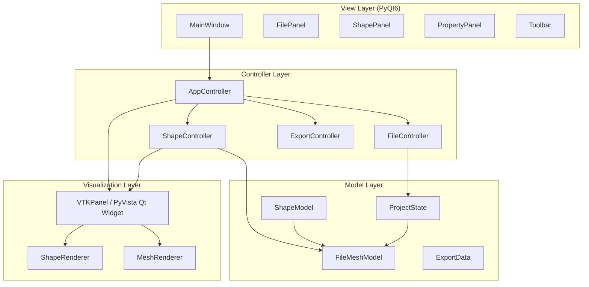

# URDF Collision Editor — Implementation Plan

## Overview

A professional Python desktop application for creating and editing URDF collision geometries for STL mesh files. It uses **PyQt6** for the GUI, **PyVista** embedded in Qt for 3D rendering, and follows a clean **MVC (Model–View–Controller)** architecture to ensure separation of concerns and extensibility.

---

## Architecture



---

## Project Structure

```
urdf_collision_editor/
├── main.py                      # Entry point
├── requirements.txt
├── README.md
│
├── models/
│   ├── __init__.py
│   ├── project_state.py         # Global project state (all files + shapes)
│   ├── mesh_model.py            # Per-file model: STL path + list of shapes
│   └── shapes/
│       ├── __init__.py
│       ├── base_shape.py        # Abstract base for all shapes
│       ├── cylinder_shape.py
│       ├── box_shape.py
│       └── sphere_shape.py
│
├── controllers/
│   ├── __init__.py
│   ├── app_controller.py        # Orchestrates everything
│   ├── file_controller.py       # File loading, navigation
│   ├── shape_controller.py      # Add/remove/update shapes
│   └── export_controller.py     # URDF XML generation
│
├── views/
│   ├── __init__.py
│   ├── main_window.py           # Root Qt window
│   ├── file_panel.py            # File list widget (left sidebar)
│   ├── vtk_panel.py             # PyVista embedded 3D viewport
│   ├── shape_list_panel.py      # List of shapes for current file
│   └── property_panel.py        # Shape parameter editor (right panel)
│
├── visualization/
│   ├── __init__.py
│   ├── scene_manager.py         # Manages PyVista plotter
│   ├── mesh_renderer.py         # STL mesh rendering
│   └── shape_renderer.py        # Primitive shapes rendering
│
├── utils/
│   ├── __init__.py
│   ├── urdf_modifier.py         # URDF XML injection and mesh matching logic
│   └── project_io.py            # JSON save/load for project files
```

---

## Data Models

### `BaseShape` (Abstract)

```python
@dataclass
class BaseShape(ABC):
    id: str                  # UUID
    name: str                # e.g. "Cylinder_1"
    position: list[float]    # [x, y, z]
    orientation: list[float] # [roll, pitch, yaw] in radians
    color: tuple             # RGBA for visualization

    @abstractmethod
    def to_urdf(self) -> str: ...

    @abstractmethod
    def to_pyvista_mesh(self) -> pv.PolyData: ...

    def to_dict(self) -> dict: ...      # for JSON serialization
    def from_dict(cls, d) -> 'BaseShape': ... # classmethod
```

### Shape Subclasses

| Shape         | Extra Fields                       |
|---------------|------------------------------------|
| `CylinderShape` | `radius: float`, `length: float` |
| `BoxShape`      | `size_x`, `size_y`, `size_z: float` |
| `SphereShape`   | `radius: float`                  |

### `MeshModel`

```python
@dataclass
class MeshModel:
    file_path: str           # Absolute path to STL
    name: str                # Filename stem
    shapes: list[BaseShape]  # Ordered list of collision primitives
    mesh_transform: list     # Optional global transform
```

### `ProjectState`

```python
@dataclass
class ProjectState:
    meshes: list[MeshModel]    # Ordered list of all loaded STL files
    current_index: int          # Index of active file
    project_path: Optional[str] # Path to saved .json project file
    urdf_path: Optional[str]    # Path to linked source URDF
    history: list               # Undo/redo command stack
```

---

## UI Layout Description

```
┌─────────────────────────────────────────────────────────────────┐
│  Toolbar: [Open Files]  [Save Project]  [Load Project]          │
├────────────┬────────────────────────────┬───────────────────────┤
│ File Panel │    3D Viewport (PyVista)   │    Shape Properties   │
│ ─────────  │                            │    ───────────────     │
│ > part1.stl│   [Interactive 3D mesh +  │  Shape: Cylinder_1    │
│   part2.stl│    collision primitives]   │  ─────────────────    │
│            │                            │  Radius:  [0.04]      │
│ 🤖 URDF     │                            │  Length:  [0.40]      │
│ [part.urdf]│                            │  Pos X:   [0.00]      │
│ [Browse]   │                            │  Pos Y:   [0.00]      │
│            │                            │  Pos Z:   [0.20]      │
│            │                            │  Roll:    [0.00]      │
│            │                            │  Pitch:   [0.00]      │
│            │                            │  Yaw:     [0.00]      │
│            ├────────────────────────────┤  ─────────────────    │
│            │  Shape List                │  [Apply Changes]      │
│            │  + [Add Shape ▼]           │                       │
│            │  ● Cylinder_1  [×]         │                       │
│            │  ● Box_1       [×]         │                       │
├────────────┴────────────────────────────┴───────────────────────┤
│           [← Previous]          [Next →] / [Finish ✓]           │
└─────────────────────────────────────────────────────────────────┘
```

**Panels:**
- **Left**: File list — clickable entries showing all loaded STL files. Active file is highlighted.
- **Center Top (70%)**: PyVista 3D viewport with full rotation/zoom/pan.
- **Center Bottom (30%)**: Shape list for the current file with add/delete controls.
- **Right**: Dynamic property editor that updates based on selected shape type.
- **Bottom Bar**: Navigation (Previous / Next / Finish).

---

## Class Design

### Controllers

#### `AppController`
- Owned by `MainWindow`
- References all sub-controllers and the `ProjectState`
- Connects Qt signals to controller methods
- Orchestrates cross-panel updates

#### `FileController`
- `load_files(paths: list[str])` → populates `ProjectState.meshes`
- `navigate_to(index: int)` → triggers mesh + shape reload in viewer
- `next_file()` / `prev_file()`
- Emits `file_changed(mesh: MeshModel)` signal

#### `ShapeController`
- `add_shape(shape_type: str)` → creates default shape, appends to current mesh
- `remove_shape(shape_id: str)`
- `update_shape(shape_id: str, params: dict)` → updates model & re-renders
- `select_shape(shape_id: str)` → populates property panel

#### `ExportController`
- `export_urdf(output_path: str)` → writes URDF collision blocks for all meshes
- `save_project(path: str)` → serializes `ProjectState` to JSON
- `load_project(path: str)` → deserializes from JSON

### Visualization

#### `SceneManager`
- Wraps `pyvista.Plotter` embedded in Qt via `pyvistaqt.BackgroundPlotter`
- `load_mesh(path: str)` — loads STL, centers/scales, renders
- `update_shapes(shapes: list[BaseShape])` — clears and re-renders primitives
- `reset_camera()`, `set_axes(show: bool)`, `set_grid(show: bool)`

#### `ShapeRenderer`
- `render_cylinder(plotter, shape: CylinderShape)`
- `render_box(plotter, shape: BoxShape)`
- `render_sphere(plotter, shape: SphereShape)`
- Each shape rendered with unique color and semi-transparency

---

## Export Format

### Single shape (cylinder):
```xml
<!-- part_name.stl -->
<collision>
  <geometry>
    <cylinder radius="0.04" length="0.40"/>
  </geometry>
  <origin xyz="0 0 0.2" rpy="0 0 0"/>
</collision>
```

### Multiple shapes:
```xml
<!-- part_name.stl -->
<collision>
  <geometry>
    <cylinder radius="0.04" length="0.40"/>
  </geometry>
  <origin xyz="0 0 0.2" rpy="0 0 0"/>
</collision>
<collision>
  <geometry>
    <box size="0.1 0.05 0.2"/>
  </geometry>
  <origin xyz="0.05 0 0" rpy="0 0 0"/>
</collision>
```

Full URDF export wraps these inside a `<link>` element.

---

## Step-by-Step Implementation Roadmap

### Phase 1 — Foundation (Days 1–2)
- [ ] Set up project structure and `requirements.txt`
- [ ] Implement `BaseShape`, `CylinderShape`, `BoxShape`, `SphereShape`
- [ ] Implement `MeshModel` and `ProjectState`
- [ ] Write unit tests for shape `to_urdf()` and `to_dict()` methods

### Phase 2 — Core UI Shell (Days 3–4)
- [ ] Create `MainWindow` with toolbar, splitter layout
- [ ] Implement `FilePanel` (list widget with highlight)
- [ ] Implement `ShapeListPanel` with add/delete buttons
- [ ] Implement `PropertyPanel` with dynamic field rendering per shape type
- [ ] Add navigation bar (Previous / Next / Finish)

### Phase 3 — 3D Visualization (Days 5–6)
- [ ] Embed `pyvistaqt.BackgroundPlotter` into center panel
- [ ] Implement `SceneManager` — load STL, camera, axes, grid
- [ ] Implement `ShapeRenderer` — colored, transparent primitives
- [ ] Wire shape selection to viewport highlight

### Phase 4 — Controllers & Wiring (Days 7–8)
- [ ] Implement `AppController` signal-slot connections
- [ ] Implement `FileController` — file dialog, navigation, state preservation
- [ ] Implement `ShapeController` — add/remove/update, real-time re-render
- [ ] Connect `PropertyPanel` edits → `ShapeController.update_shape()`

### Phase 5 — Export & Persistence (Day 9)
- [ ] Implement `ExportController.export_urdf()`
- [ ] Implement `ProjectIO.save_project()` and `load_project()`
- [ ] Trigger export dialog on "Finish"

### Phase 6 — Polish & Bonus Features (Day 10+)
- [x] Undo/redo command stack (Command Pattern)
- [ ] Shape color picker
- [ ] Snap-to-mesh bounding box auto-fit tool
- [ ] Visual transform gizmo (if using VTK directly)
- [x] Dark theme with Qt stylesheet (QSS)
- [x] Export directly into full URDF file (via injection)
- [x] Scale matching for injected collisions

---

## Dependencies (`requirements.txt`)

```
PyQt6>=6.6.0
pyvista>=0.43.0
pyvistaqt>=0.11.0
numpy>=1.26.0
lxml>=5.0.0        # For robust XML generation
```

---

## Scalability & Maintainability Notes

| Topic | Recommendation |
|-------|---------------|
| New shapes | Subclass `BaseShape`, register in a `SHAPE_REGISTRY` dict |
| Auto-fit algorithms | Add to `shape_controller.py` as strategy classes |
| Undo/Redo | Use Command Pattern — each action is an undoable `Command` object |
| Plugin system | `importlib`-based shape discovery from a `plugins/` directory |
| Testing | Use `pytest` + `pytest-qt` for UI testing |
| CI/CD | GitHub Actions with lint (ruff) + test pipeline |
| Packaging | `PyInstaller` or `cx_Freeze` for distributable binary |

---

## Confirmed Design Decisions

| Question | Decision |
|---|---|
| Coordinate frame | **World origin** — positions are in world space |
| Orientation in UI | **Degrees** (roll/pitch/yaw) — auto-converted to radians for URDF `rpy` |
| Export format | **Both** — `.txt` for URDF `<collision>` snippets + `.json` project file |
| PyQt version | **PyQt6** — neither version was pre-installed; PyQt6 is the modern choice |
